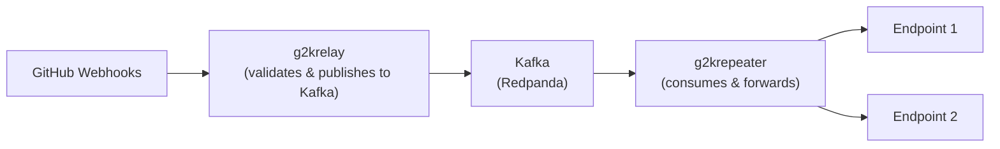

# Consume webhook events to kafka and forward them to 1 or multiple endpoints



## g2krelay

A simple server to forward github webhook events to kafka keeping webhook headers and body intact.
All webhook events are validated with wbhook secret.

## g2krepeater

A kafka consumer that reads from the topic and sends POST requests to specified endpoint with the original webhook payload and headers.
This enables apps that use webhooks to be able to use kafka as a message bus without needing a change.

## Running the server

For easy setup install `tilt` and `kind`

1. Create a `dev` `kind` cluster

```bash
kind create cluster --name dev
```

2. Run `tilt up`

The tilt setup uses `redpand` for running kafka locally. In addition we bootstrap `redpand-console` so that you can see the messages.

## Todo

- [x] Upload images to docker
- [x] Add support to g2krepeater for sending requests to multiple endpoints (fanout)
- [ ] More documentation
